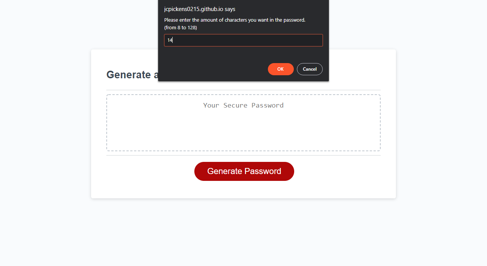

# Password-Generator

## Description
A simple password generator. To use it, click the "Generate Password" button, and you'll follow a series of prompts. The program will ask you how long you want your password to be, and then it'll ask you which types of character sets to include. The character types are:  

- lower case letters
- UPPER CASE LETTERS
- Numbers (0-9)
- Special Characters (!@# and so on)

After you finish the prompts, your shiny new password will be printed in the textarea element!

## Background
I started learning javascript, and to test my skills, I started programming a password generator. I started by thinking about how I wated to receive input. window.alert(), window.prompt(), and window.confirm() are the methods I used for this.

### Input Validation
This is the biggest hurdle I had to overcome. The password generation part was fairly easy by comparison. Because window.prompt() outputs a string containing what the user typed, I needed to convert that string into a number before I could validate it. First I check if the value is NULL, and if it is, provide and error message and quit. Then I check if the value is NaN (Not a Number). This also gives an error then quits. Then I can finally check if the value is thus: 8 > Value > 128. If the expression is true, then the prompts ask the user if they want to use each type of character. If none of the character types are selected, give an error and quit.

### Password Generation
I have 4 arrays, holding the different sets of character types. I start with a new empty array, and for each character type requested, I concatenate that type's set array to the empty one. Then, for each of the characters in the character count, it chooses a random character in the concatenated set, and appends it to the final result variable, which is returned after the loop.

## Link
[Click here to see the finished site.](https://jcpickens0215.github.io/Password-Generator/)

## Screenshot
